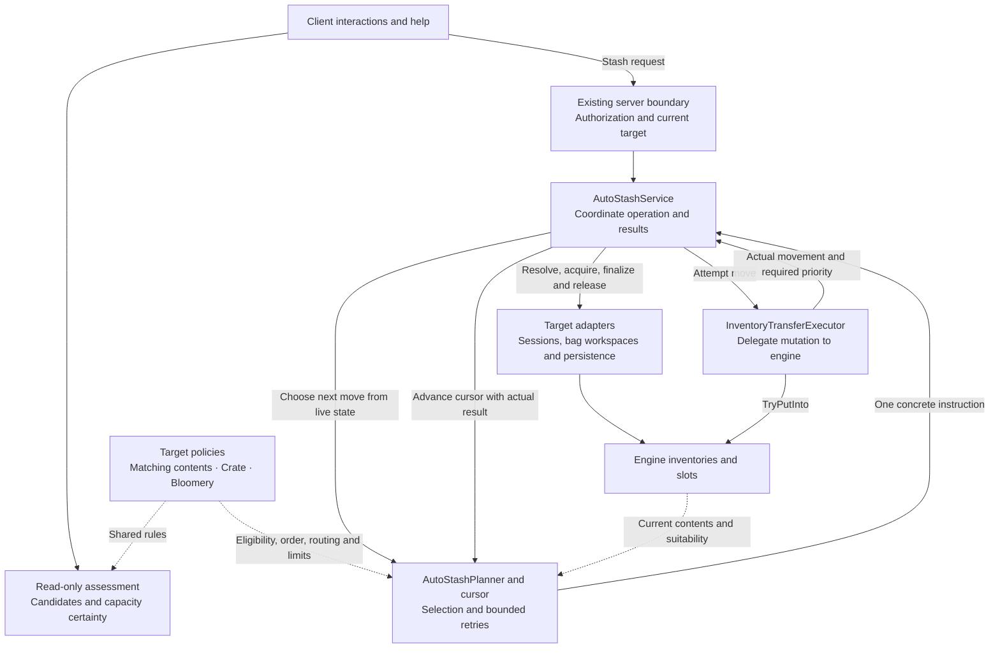

# AutoStash Planning and Execution Proposal

Status: Architecture partially implemented: concrete engine transfer contracts and the shared executor are in place. Planning, coordination, lifecycle adapters and shared assessment remain planned. See [implementation plan](PlanningAndExecution.todo).

## Purpose

Separate AutoStash eligibility, transfer planning, inventory mutation, and target lifecycle so ordinary containers, crates, bloomeries, and attached bags can share execution without losing their individual rules.

The central design is incremental planning: select one concrete move from current inventory state, execute it through the engine, then use the actual result to plan the next move. An AutoStash operation is best-effort and may partially succeed; it is not an atomic transaction.

## Current implementation

The analysis is based on these repository sources:

- [AutoStashTransferService](../../VanillaExpanded/src/AutoStashing/AutoStashTransferService.cs) combines preflight checks, player-source enumeration, inventory session ownership, destination selection, mutation, and auditing.
- [BlockBehaviorAutoStashable](../../VanillaExpanded/src/AutoStashing/BlockBehaviorAutoStashable.cs) combines interaction handling with eligibility queries, container dispatch, and a separate bloomery transfer loop.
- [EntityAttachedContainerAutoStash](../../VanillaExpanded/src/AutoStashing/EntityAttachedContainerAutoStash.cs) resolves attached bags, prepares inventories, invokes the shared service, and persists bag contents.
- [AutoStashSystem_Server](../../VanillaExpanded/src/ModSystems/AutoStashSystem_Server.cs) validates requests and dispatches server operations.
- [AutoStashTransferTests](../../VanillaExpanded.Tests/Unit/AutoStashing/AutoStashTransferTests.cs) describes existing transfer, capacity, session, and workspace expectations.

The shared service accepts an item predicate, an optional preferred slot, a session-management boolean, and a target finalization callback. These inputs cannot describe bloomery quantity limits or source-pass ordering, so the bloomery implements its own execution path. Client eligibility also reconstructs rules independently of execution.

The optional preferred-slot contract is inconsistent: preflight treats a valid preferred index as exclusive, whereas execution can fall back to other destinations. Current production callers do not supply that argument. This is a source-level abstraction inconsistency, not a reproduced gameplay defect.

## Established regression contract

The completed coverage work provides the starting contract for this extraction. Its checklist and evidence were intentionally removed in commit 3917cfa; the final evidence remains in Git revision 476f3b3 at docs/auto-stash/FunctionalTestCoverageEvidence.md. The recorded final runs passed 357 AutoStash unit cases, 553 repository unit cases and one separate Harmony integration test, with no failures or skips. These are historical results, not a fresh verification of a future refactor.

Three separately authorized changes are already implemented: bounded direct-merge retries with owning-player error chat, failure-safe target finalization through AutoStashMutationState, and the IProgressSystemProvider presentation dependency. Preserve them during extraction. The progress provider, interaction state machines, network authorization and Harmony hookup remain in their current owners.

Retain the existing regression tests as the behavioral oracle. Tests using generic inventories establish crate matching policy; separately initialized engine crate fixtures establish real crate restrictions. Attached-bag tests verify both vanilla workspaces and distinct IHeldBag implementations through actual persisted bag and attachment-owner reloads.

## Scope

The proposal covers internal AutoStash planning and execution, client eligibility assessment, and target lifecycle adapters. Network authorization remains in the existing server boundary. Interaction timing, gestures, sounds, animations, and packet formats retain their current ownership.

The initial refactor must preserve observable transfer behavior. It does not introduce rollback, asynchronous execution, persisted plans, a new inventory simulation, or a general inventory framework. Changes to ordering, eligibility, or merge behavior require separate decisions and focused validation.

## Responsibilities

| Component | Responsibility |
| --- | --- |
| `AutoStashPolicy` | Own target-specific eligibility, ordered source passes, destination restrictions, and live quantity limits. |
| `AutoStashPlanner` | Evaluate candidates and select the next permitted concrete transfer without modifying inventories. |
| `InventoryTransferExecutor` | Execute one concrete transfer through engine APIs and report the actual outcome. |
| `AutoStashService` | Coordinate assessment, lifecycle, planning, execution, mutation progress, aggregate results, auditing, and existing direct-merge failure feedback. |
| Target adapters | Resolve usable target inventories and own session acquisition, persistence, and target dirty notifications. |

These names describe proposed responsibilities, not a requirement for an interface per class. Introduce interfaces where distinct implementations or a meaningful test boundary require them. Keep engine inventory and slot objects as the owning data model.

### High-level flow

The service owns the operation. Planning and execution repeat one move at a time, using actual movement to advance the cursor and current contents to determine the next move. Client assessment shares policy rules but does not execute transfers.

Adapters finalize applied or uncertain changes before releasing owned sessions, including when execution throws. Assessment remains advisory; the server resolves current state again for every request.

## Data contracts

### Transfer instruction

`InventoryTransfer` describes exactly one attempted move:

- Source and destination slots.
- Positive requested quantity.
- Engine move settings, including merge priority and modifier keys.

An instruction is valid only for immediate execution within the current server operation. It must not be serialized, retained across ticks, or supplied by a client. The executor checks basic validity and delegates authoritative movement checks to the engine. Preserve the exact move-operation settings and overload semantics of both existing loops, including engine-required priority reporting. Target-specific constraints are evaluated immediately before execution.

### Transfer result

`InventoryTransferResult` reports requested quantity, actual moved quantity, and any exposed engine-required merge priority. Preserve overload dispatch as well as settings: explicit-operation instructions report the operation's nullable RequiredPriority; engine-default instructions retain the virtual world/quantity convenience overload, which exposes only actual movement, so their RequiredPriority is unavailable (null). A zero result is an ordinary execution outcome and must advance planner state. Requested quantities must never be counted as successful movement.

### Operation result

`AutoStashResult` reports total actual movement and an outcome distinguishing unavailable targets, no eligible candidates, no available destination, and successful movement. Successful movement can be partial and can coexist with exhausted direct-merge failures. Retain a separate failure indicator so movement does not suppress the existing error feedback. Exceptions continue to propagate through failure-safe finalization; they are not converted into an ordinary successful result. Preserve enough result information for auditing and persistence without inventing a guaranteed total quantity that the planner has not established.

### Eligibility assessment

`AutoStashAssessment` distinguishes candidate existence from apparent transfer availability and includes representative stacks for interaction help. An assessment is advisory, not a reservation or promise of successful execution.

## Policy contracts

Policies must express three independent decisions: whether a source item is eligible, where it may go, and how much may currently move. Source-pass ordering is explicit and deterministic.

### Matching contents

Capture the target's accepted item types at the start of the operation. New contents created during that operation must not expand the accepted set. Delegate destination ranking to vanilla inventory suitability logic. Keep item-type eligibility distinct from actual stack compatibility, which remains engine-owned.

### Crate

Capture the initially accepted item type and preserve existing crate slot restrictions. An empty crate remains ineligible under the existing behavior.

### Bloomery

Retain burning/output checks, ore and fuel classification, mandatory destination slots, ratio handling, and current capacity calculations. Quantity limits are recalculated from live contents after preceding moves.

The existing execution order is backpack ore, backpack fuel, hotbar ore, then hotbar fuel. Preserve that ordering initially. Processing all ore before all fuel may be desirable, but is a separate behavioral change.

Destination routing must distinguish a required slot from ordinary best-suited selection. Bloomery routing is required-slot routing, with no fallback into another slot.

The empty-bloomery active-hotbar condition currently belongs to client interaction eligibility and is absent from server transfer execution. Retain this distinction explicitly rather than silently promoting it to a server rule.

### Attached bags

Use matching-content policy for transfers. Workspace creation, slot refresh, and bag persistence belong to the adapter, not the policy or transfer executor.

## Incremental planning and execution

1. Validate the request at the existing server boundary and resolve the target adapter.
2. Resolve player sources in their established order and capture request-level policy data.
3. Probe for a plausible transfer without opening an inventory session or mutating contents.
4. Acquire the target's required execution lifecycle only when work appears possible.
5. Revalidate live target state and select the next concrete transfer.
6. Execute through `ItemSlot.TryPutInto` and record actual movement.
7. Advance the planner cursor using the outcome, then repeat until no permitted work remains.
8. Persist applied changes, emit audit information, and release owned lifecycle resources.

The planner cursor owns attempted destinations and deferred direct-merge candidates for the current source. Its lifetime and reset boundaries must preserve the existing source-by-source algorithm. Every zero-move attempt must either exclude a destination, consume a bounded retry, or end that source pass. A direct-merge retry must not requeue itself indefinitely.

Preserve the implemented direct-merge guarantees: exhaust automatic alternatives before deferred direct attempts; inspect every live engine-eligible empty or same-item destination, including those excluded by automatic eligibility; exclude each rejected direct destination until positive movement changes the remaining source state. Resetting exclusions requires actual movement, so retries between progress steps remain finite. The engine may still reject an eligible selected destination; eligibility is not a promise of movement.

Aggregate exhausted direct attempts across sources. After normal finalization and owned-session cleanup, preserve one general-chat CommandError to the owning server player, identified by inventory-manager identity, even if some items moved. A later successful retry that exhausts a source does not leave a stale failure for that source. Ordinary full-target/no-work rejection remains silent. Preserve the existing audit behavior and exception paths; do not add a new notification channel.

Preserve current automatic-merge selection and deferred direct-merge behavior before considering changes. Preserve the engine move settings used by each existing path; sharing an executor does not imply normalizing modifier keys.

Ordinary destination selection continues to use `IInventory.GetBestSuitedSlot`. Mutation continues to use `ItemSlot.TryPutInto`, retaining inventory restrictions, collectible merge behavior, and modification callbacks. Do not replace those APIs with direct stack-size edits or a duplicate suitability algorithm.

A complete precomputed list of exact moves would require predicting engine callbacks and changes caused by prior moves. The incremental design avoids that requirement. For example, bloomery fuel allowance uses ore actually transferred, not an earlier expected ore quantity.

## Client assessment

Assessment and execution share policy eligibility and destination-selection rules. Client interaction gates remain a separate input so client-only conditions do not silently become execution restrictions.

Assessment must not open sessions, refresh a mutable server workspace, invoke transfer operations, or persist contents. Attached-container assessment can use the available client contents view without constructing an execution workspace. If that view supports only candidate detection, the assessment must represent capacity as unknown rather than claiming that movement is possible. Preserve representative ordering/deduplication and independent display-stack clones, exact help actions/modifiers, and the distinction between full targets and no matching items.

The server always resolves current state and plans again. It does not trust client assessment or accept client-authored transfer instructions. UI callers can use candidate and capacity information to retain existing interaction help behavior, including the distinction between no matching contents and a full target.

## Target lifecycle and partial failure

Adapters express lifecycle behavior directly instead of exposing a `manageInventorySession` flag to the transfer algorithm:

- Ordinary containers open only when necessary and close only sessions acquired by this operation.
- Bloomeries retain their existing block-entity dirty notification behavior.
- Attached bags preserve workspace slot identities and persist through `IHeldBag.Store`, attachment-slot dirty marking, and the attachment owner's storage mechanism.

Finalization runs even when execution fails after earlier successful moves. Persist known applied changes before releasing the session, and use a nested cleanup boundary so a persistence failure cannot prevent session release. Report failures without claiming rollback or completion. Engine callback exceptions may occur after mutation, so lifecycle handling must conservatively account for attempted mutations rather than assuming that an unreturned move left state untouched.

Reuse the established AutoStashMutationState accounting or move it without weakening its contract: begin uncertainty immediately before the engine mutation call, clear it only after normal return, and finalize actual or uncertain changes. Ordinary completed zero-move operations do not finalize. Save live bag slots through IHeldBag.Store, mark the attachment dirty and store the owner before closing an owned workspace session; temporary bag inventories do not open sessions. Retain vanilla workspace callbacks and slot identity.

Preserve the original exception identity and stack through finalization and cleanup. Secondary persistence/cleanup failures are reported without replacing it, and a reporting failure cannot prevent cleanup. If no earlier exception exists, propagate the first finalization/cleanup failure. Persistence failure does not imply rollback or guaranteed durable storage.

Inventory session acquisition is not an atomicity or locking guarantee. Plans remain immediate and local to one server operation.

## Source layout and dependencies

Keep this implementation under `AutoStashing` initially:

- `Planning/`: policy contracts and implementations, assessment, planner, and operation cursor.
- `Transfers/`: concrete transfer instruction, transfer result, and engine executor.
- `Targets/`: adapters for block containers, bloomeries, and attached bags.
- `AutoStashService.cs`: operation coordination.
- Existing interaction classes: input handling and presentation.

Each file owns one named responsibility. Interaction and network entry points delegate to the service. Planning depends on policy contracts and engine inventory types, not GUI or network code. The executor depends on engine APIs and transfer contracts, not target adapters. Adapters depend on their owning game container APIs.

Add XML documentation for introduced classes and methods, explain nontrivial control flow, and group methods by visibility and functional family according to repository conventions.

## Relationship to alloy deposits

[AlloyDepositPlan](../../VanillaExpanded/src/AlloyCalculator/AlloyDepositPlan.cs) describes desired ingredient allocations. AutoStash describes opportunistic transfers. Its explicit data model is useful precedent, but the two operations do not require a shared planner.

Alloy deposit execution currently uses client inventory operations and packets, whereas AutoStash executes on the server. Do not merge those execution paths as part of this refactor. Extract a broader inventory module only when another concrete caller needs the same semantics.

## Validation requirements

Existing tests are characterization evidence to preserve, not proof that this proposal is implemented. Focused validation must cover:

- Matching-content snapshots, empty crates, incompatible stacks, full targets, and partial capacity across multiple slots.
- Backpack/hotbar ordering and the exact existing bloomery ore/fuel pass order.
- Bloomery ratio handling and fuel limits based on actual preceding transfers.
- Required-slot routing with no fallback.
- Zero-move termination, exhaustive direct destinations, progress-based retry resets and exact owner-only error chat.
- State changes between assessment and execution, with server re-evaluation.
- No session acquisition for operations with no plausible work; already-open sessions remain open; owned sessions close on failure.
- Attached workspace slot identity, repeated loads, and persistence of partial progress.
- Cleanup when execution or persistence throws, including possible mutation before callback failure, persistence-before-close and original/secondary exception handling.
- Continued server-side transfers without introducing client transfer API calls.

Run builds and tests through subagents as required by repository instructions. Review the extraction for preserved behavior before changing any policy. Run actual Harmony dispatch in its separate integration test host: remove ordinary patch owners in finally and release the reverse-patched stand-in through dedicated process termination before fresh unit-test hosts. Do not introduce Harmony patching into ordinary unit tests. Live game checks remain user-run and are separate from passing automated tests.

## Acceptance criteria

The proposal is satisfied when all target types share the concrete transfer executor and operation coordinator; policy owns target-specific routing, limits, and ordering; adapters own lifecycle and persistence; and interaction classes no longer contain transfer loops. Shared assessment must make its certainty explicit. Existing engine algorithms remain authoritative, and focused validation demonstrates preserved behavior and bounded progress.

## Evidence limits

The original architecture analysis was source-only. Subsequent coverage execution reproduced and resolved the retry and failure-finalization defects under separate user authorization; its historical results are identified above. This proposal update inspected current source, tests and recorded evidence without running fresh builds, tests or the game. No automated result establishes live-game acceptance or implementation of the proposed architecture.
